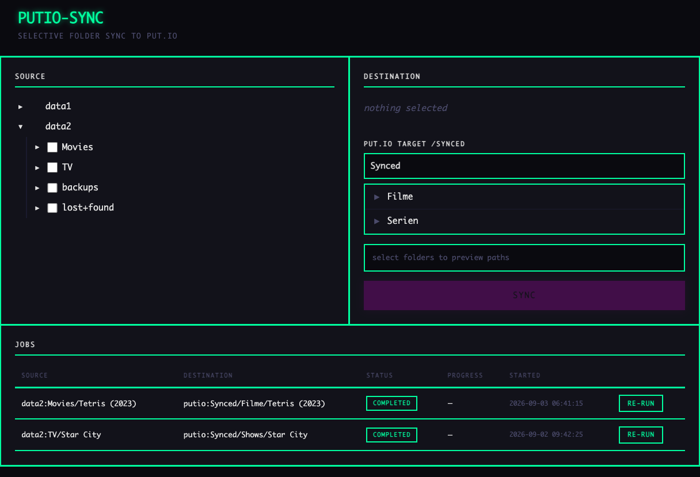

# putio-sync

Thin web UI for selectively syncing local folders to [put.io](https://put.io) via [rclone](https://rclone.org)'s remote control (rc) API.



## What it does

- Browse local filesystem remotes (e.g. bind-mounted disks) with a folder tree
- Select multiple folders via checkboxes
- Browse put.io destination folders with breadcrumb navigation
- Preview the resulting `source -> putio:destination` paths before syncing
- Start async rclone `sync/copy` jobs
- Live status table with progress %, transferred/total bytes, speed, ETA, active file list
- Stop running jobs from the UI
- Responsive layout (works on mobile/iPhone)

## Architecture

```
Browser -> Flask app (port 8080) -> rclone rcd (port 5572) -> put.io
```

The Flask app is a thin UI + job manager. All transfers are handled by rclone's rc API — the app never touches file data directly.

## Prerequisites

- A running rclone `rcd` daemon with a `putio` remote configured
- One or more `local` or `alias` remotes in rclone config pointing at the directories you want to sync from
- Python 3.12+ with Flask

## Configuration

All configuration is via environment variables:

| Variable | Default | Description |
|---|---|---|
| `PUTIO_SYNC_DB` | `/opt/putio-sync/sync.db` | Path to the SQLite database for job persistence |
| `RCLONE_RCD_URL` | `http://localhost:5572` | URL of the rclone rc daemon |
| `PUTIO_DEST_ROOT` | `Synced` | The put.io folder to use as the destination root in the UI. Folder must exist on put.io. |

## rclone config

Example `rclone.conf`:

```ini
[local]
type = local
nounc = true

[data1]
type = alias
remote = local:/data1

[data2]
type = alias
remote = local:/data2

[putio]
type = putio
token = {"access_token":"YOUR_TOKEN","expiry":"0001-01-01T00:00:00Z"}
```

The `local` backend is required for `alias` remotes to resolve. Source remotes (`data1`, `data2`) appear in the folder browser. The `putio` remote is the sync destination.

## Installation

### Manual

```bash
apt-get install -y python3-flask
mkdir -p /opt/putio-sync/templates
cp app.py /opt/putio-sync/
cp templates/index.html /opt/putio-sync/templates/
```

### systemd service

`/etc/systemd/system/putio-sync.service`:

```ini
[Unit]
Description=putio-sync Web UI
After=network-online.target rclone-rcd.service
Wants=network-online.target
Requires=rclone-rcd.service

[Service]
Type=simple
ExecStart=/usr/bin/python3 /opt/putio-sync/app.py
WorkingDirectory=/opt/putio-sync
Environment=PUTIO_DEST_ROOT=Synced
Environment=RCLONE_RCD_URL=http://localhost:5572
Restart=always
RestartSec=5

[Install]
WantedBy=default.target
```

### rclone rcd service

`/etc/systemd/system/rclone-rcd.service`:

```ini
[Unit]
Description=rclone Remote Control Daemon
After=network-online.target
Wants=network-online.target

[Service]
Type=simple
ExecStart=/usr/bin/rclone rcd --rc-addr :5572 --rc-web-gui --rc-serve --rc-no-auth --config /root/.config/rclone/rclone.conf
Restart=always
RestartSec=10

[Install]
WantedBy=default.target
```

## Usage

1. Open `http://<host>:8080` in a browser
2. Expand source remotes (data1, data2) and check folders to sync
3. Navigate the put.io destination browser to choose where to sync
4. Review the path preview to verify no path duplication
5. Click "Sync to put.io"
6. Monitor progress in the status table at the bottom

## Notes

- Source bind mounts should be read-only (`ro=1` in Proxmox pct config) for safety
- The app uses `sync/copy` (not `sync/sync`) — it copies new/changed files but does not delete files on put.io that no longer exist locally
- Jobs are persisted in SQLite; if rclone rcd is restarted, running jobs whose rclone job IDs no longer exist are automatically marked as completed
- No authentication on the web UI or rc API — intended for local network use only. If exposing externally, add `--rc-user`/`--rc-pass` to rclone rcd and put a reverse proxy with auth in front of the Flask app
